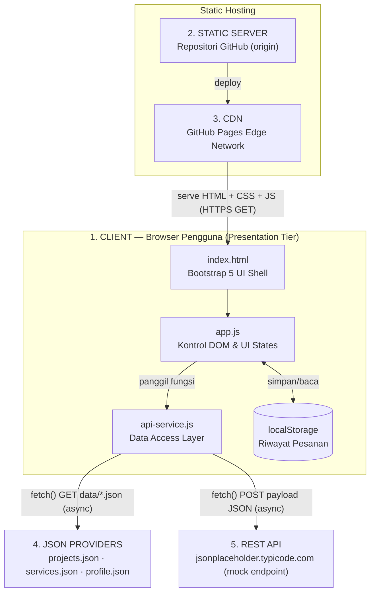
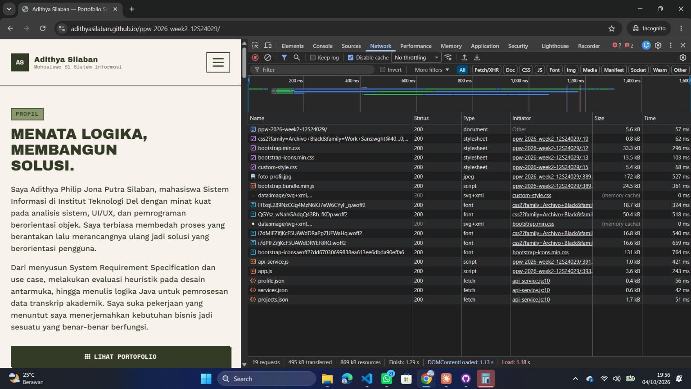
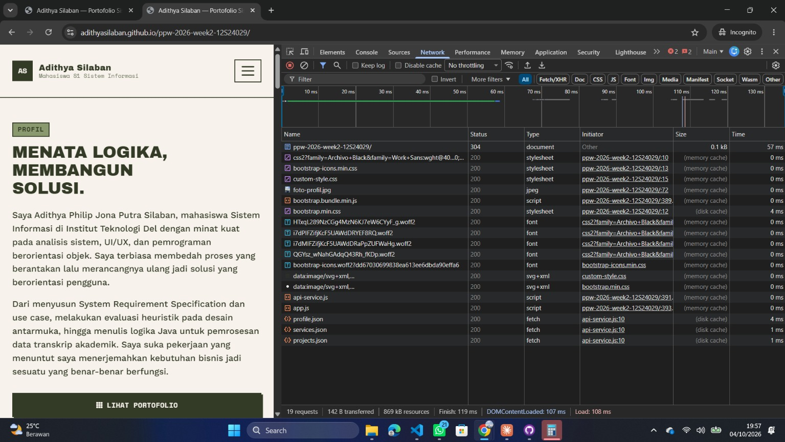

# Portofolio & Service Portal — Adithya Silaban

**Nama:** Adithya Philip Jona Putra Silaban
**NIM:** 12S24029
**Kelas:** 13SI1
**Mata Kuliah:** Pemrograman dan Pengujian Web (12S3101)
**Live demo:** [https://adithyasilaban.github.io/ppw-2026-week2-12S24029/](https://adithyasilaban.github.io/ppw-2026-week2-12S24029/)

## Ringkasan Pembaruan Minggu 4

Merefaktor arsitektur portofolio Minggu 3 (Bootstrap 5, data proyek/layanan/modal
ditulis statis di dalam `index.html`) menjadi arsitektur **decoupled multi-tier**:
seluruh data dipindahkan ke penyedia data JSON terpisah, dirender secara dinamis
lewat JavaScript ES6+ (`fetch` + `async/await`), dan formulir konsultasi kini
terkirim secara asinkron tanpa memuat ulang halaman.

## Diagram Arsitektur (C4 Container Model)


</details>
**Alur baca diagram (penomoran 1–5 sesuai urutan yang diminta modul):**
1. **Client** (browser pengguna) memuat dan menjalankan seluruh Presentation Tier: `index.html`, `app.js`, `api-service.js`, dan `localStorage` — semuanya berjalan sepenuhnya di sisi klien.
2. **Static Server** — repositori GitHub tempat seluruh berkas proyek (HTML/CSS/JS/JSON) disimpan sebagai sumber asli (*origin*).
3. **CDN** — jaringan edge GitHub Pages yang mendistribusikan salinan berkas statis tadi ke Client dengan latensi rendah.
4. **JSON Providers** — tiga berkas data (`projects.json`, `services.json`, `profile.json`) yang bertindak sebagai *decoupled mock data layer*; secara fisik berkas ini ikut disajikan lewat CDN yang sama, tapi secara logis dipisahkan sebagai tier tersendiri karena tanggung jawabnya murni menyimpan data, bukan logika tampilan.
5. **REST API** — endpoint eksternal (`jsonplaceholder.typicode.com`) yang mensimulasikan backend sungguhan untuk menerima pengiriman form konsultasi via `POST`, karena GitHub Pages sendiri tidak punya server aplikasi.

### Narasi Separation of Concerns

Tiga lapisan arsitektur di atas dipisahkan secara fisik lewat struktur folder:
 
- **Presentation Tier** (`index.html`, `css/custom-style.css`, `js/app.js`) — mengelola tampilan, state UI (loading/success/empty/error), filter, modal universal, dan interaksi form. Tidak pernah memanggil `fetch()` secara langsung.
- **Application/Service Logic Tier** (`js/api-service.js` + REST API eksternal) — satu-satunya berkas yang memanggil `fetch()`. Bertanggung jawab mengambil data, memvalidasi respons HTTP (`response.ok`), dan melempar error yang akan ditangkap lapisan presentasi sebagai Error State.
- **Data Storage Tier** (`data/*.json`) — sumber data mandiri yang bisa diganti ke API sungguhan kapan pun tanpa mengubah `app.js`, karena kontraknya (bentuk data yang dikembalikan) tetap sama.
Pemisahan ini membuat tiap lapisan bisa diuji dan diganti secara independen — prinsip inti dari arsitektur *decoupled*. Sebagai ilustrasi: kalau suatu saat `jsonplaceholder.typicode.com` diganti dengan backend Express/Laravel sungguhan, satu-satunya berkas yang perlu disentuh adalah `api-service.js` — `app.js` dan seluruh tampilan tidak perlu diubah sama sekali, karena bentuk data (`{id, title, ...}`) yang dikembalikan tetap sama.

## Tabel Komparasi: Sebelum (Minggu 3) vs Sesudah (Minggu 4)

| Aspek | Minggu 3 | Minggu 4 |
|---|---|---|
| Sumber data proyek | Hardcode di `index.html` (4 kartu ditulis manual) | `data/projects.json`, dimuat via `fetch()` |
| Sumber data layanan (dropdown Topik) | `<option>` statis di HTML | `data/services.json`, dirender dinamis ke `<select>` |
| Data profil (Vitals) | Teks statis di HTML | `data/profile.json`, diisi via JavaScript saat halaman dimuat |
| Modal detail proyek | 4 elemen `.modal` terpisah, satu per proyek | **1** elemen `.modal` universal, konten diinjeksi berdasarkan `data-project-id` |
| Status antarmuka | Tidak ada — hanya tampilan statis | 4 UI states dikelola eksplisit: Loading, Success, Empty, Error |
| Filter kategori | Tidak ada | Tombol filter kategori, menyaring kartu secara instan di sisi klien |
| Pengiriman form | `action="#"`, tidak benar-benar mengirim data ke mana pun | `fetch()` POST asinkron ke REST API mock, tanpa reload halaman |
| Feedback pengiriman form | Tidak ada | Toast Bootstrap (sukses/gagal) + tombol submit menampilkan spinner saat proses |
| Riwayat pesanan | Tidak ada | Disimpan di `localStorage`, ditampilkan sebagai badge jumlah pesanan |
| Keamanan data dinamis | Tidak relevan (semua statis) | Fungsi `escapeHTML()` diterapkan pada setiap nilai dari JSON sebelum disuntikkan ke `innerHTML`, mencegah DOM-based XSS |
| Content Security Policy | Tidak ada | Meta tag CSP membatasi sumber script/style/font/koneksi yang diizinkan |
| Struktur folder | `index.html`, `style.css` di root | Dipisah ke `css/`, `js/`, `data/`, `assets/` sesuai peran masing-masing |

## Tabel Pengukuran Kinerja (DevTools Network)

Pengujian dilakukan di jendela **Incognito** (ekstensi browser otomatis nonaktif, sehingga hasil murni mengukur proyek ini saja — lihat Catatan Metodologi di bawah) pada URL *production* GitHub Pages (`adithyasilaban.github.io/ppw-2026-week2-12S24029/` — repo yang sama dipakai sejak Minggu 2, hanya branch sumber Pages-nya yang diganti tiap minggu).
 
| Metrik | Cold Load (Disable cache ✓) | Warm Load (Disable cache ✗, tab baru) |
|---|---|---|
| Jumlah request | 19 | 19 |
| Ukuran transfer total | 495 KB | **142 B** |
| Ukuran resource (uncompressed) | 869 KB | 869 KB |
| DOMContentLoaded | 1.13 s | **107 ms** |
| Waktu total load halaman (Load) | 1.18 s | **108 ms** |
| **Status `index.html` (dokumen utama)** | 200 OK · 5.6 kB · 57 ms | **`304 Not Modified` · 0.1 kB · 57 ms** |
| `custom-style.css` | 200 · 5.4 kB · 68 ms | 200 · (memory cache) · 0 ms |
| `bootstrap.min.css` | 200 · 33.3 kB · 296 ms | 200 · (disk cache) · 4 ms |
| `foto-profil.jpg` | 200 · 172 kB · 527 ms | 200 · (memory cache) · 0 ms |
| `bootstrap.bundle.min.js` | 200 · 24.5 kB · 361 ms | 200 · (memory cache) · 0 ms |
| `api-service.js` | 200 · 1.0 kB · 421 ms | 200 · (memory cache) · 0 ms |
| `app.js` | 200 · 3.6 kB · 243 ms | 200 · (memory cache) · 0 ms |
| `profile.json` | 200 · 0.4 kB · 56 ms | 200 · (disk cache) · 4 ms |
| `services.json` | 200 · 0.6 kB · 42 ms | 200 · (disk cache) · 1 ms |
| `projects.json` | 200 · 1.7 kB · 51 ms | 200 · (disk cache) · 1 ms |

**Insight dari angka di atas:**
- Waktu load turun dari **1.18 s → 108 ms (~91% lebih cepat)** begitu cache aktif pada kunjungan kedua.
- **Dokumen `index.html` sendiri menghasilkan status `304 Not Modified` sungguhan** (bukan cuma "from cache") — ini bukti nyata browser mengirim *conditional request* ke CDN GitHub Pages, divalidasi lewat `ETag`, dan server membalas tanpa mengirim ulang isi berkas (hanya header, 0.1 kB), menghemat bandwidth dibanding mengirim ulang 5.6 kB penuh. Lihat analisis detail di bawah.
- Resource lain (CSS/JS/JSON) tervalidasi lewat `(memory cache)` atau `(disk cache)` — strategi caching browser yang berbeda lapis dari `304`, dijelaskan di bagian berikut.
- `foto-profil.jpg` (172 kB) tetap aset terberat saat Cold Load (527 ms) — kandidat utama untuk dikompres/dikonversi ke WebP pada iterasi berikutnya.

**Screenshot Waterfall (lampiran bukti, diambil di jendela Incognito):**


*Cold Load — 19 request, 495 KB transfer, Load 1.18 s*


*Warm Load — 19 request, hanya 142 B transfer, Load 108 ms; baris dokumen utama berstatus `304`, resource lain `(memory cache)`/`(disk cache)`*


> **Catatan metodologi:** pengujian awal (sebelum ini) sempat tercampur entri dari ekstensi browser (`FloatingActionButton.js`, `AdobeClean-*.otf`, dkk) yang bukan bagian proyek. Pengujian ini diulang di jendela **Incognito**, di mana ekstensi otomatis nonaktif — terbukti dari jumlah request turun dari 35–36 menjadi tepat **19 di kedua kondisi**, sehingga seluruh baris pada tabel di atas 100% milik proyek ini.

### Analisis Status HTTP 304 Not Modified
 
Pengujian kali ini **berhasil menangkap `304 Not Modified` sungguhan** pada baris dokumen utama (`index.html`) di kondisi Warm Load — ini bisa dijelaskan secara ilmiah sebagai berikut:
 
- **`304 Not Modified`** terjadi ketika browser mengirim *conditional request* (header `If-None-Match` berisi nilai `ETag` dari respons sebelumnya) ke server. Kalau berkas di server belum berubah, server membalas `304` dengan **body kosong** (cuma 0.1 kB di pengujian ini, dibanding 5.6 kB penuh saat Cold Load) — tetap ada 1 *round-trip* ke jaringan (bukti: Time-nya tetap tercatat 57 ms, bukan 0 ms), tapi bandwidth yang ditransfer jauh lebih hemat.
- **`(memory cache)` / `(disk cache)`** — yang terlihat pada *resource* lain seperti CSS, JS, dan berkas JSON — adalah strategi berbeda yang **lebih agresif**: kalau header `Cache-Control` server masih mengizinkan salinan lokal dipakai tanpa validasi ulang sama sekali (belum kedaluwarsa), browser bahkan **tidak mengirim request apa pun ke jaringan** (makanya Time-nya 0–4 ms, nyaris instan).
- **Kenapa `index.html` beda sendiri (dapat 304, bukan cache langsung)?** Kemungkinan besar karena GitHub Pages menetapkan `Cache-Control` yang lebih ketat/pendek masa berlakunya untuk dokumen HTML utama dibanding aset statis (CSS/JS/gambar) — praktik umum hosting statis supaya pembaruan konten HTML cepat terlihat pengguna, sementara aset pendukung yang jarang berubah boleh di-cache lebih agresif.
> **Catatan kejujuran:** GitHub Pages mengatur header `Cache-Control` dan `ETag` secara otomatis di sisi mereka — proyek ini tidak mengonfigurasi header caching secara manual (karena memang tidak memungkinkan di static hosting tanpa server kustom). Tabel dan analisis di atas melaporkan **hasil pengamatan apa adanya**.
 
### Verifikasi Fungsional Tambahan (CSP)
 
Pada pengujian sebelumnya, Console sempat menunjukkan 2 *warning* pelanggaran `Content-Security-Policy` terkait `connect-src`. Untuk memastikan ini tidak mengganggu fungsi inti, form konsultasi diuji coba langsung di situs live — **hasilnya berhasil mengirim dan menampilkan toast "Sukses"**, membuktikan jalur `fetch() POST` ke REST API mock tetap berfungsi normal terlepas dari warning tersebut (kemungkinan besar berasal dari ekstensi browser yang mencoba melakukan koneksinya sendiri, bukan dari kode `api-service.js` — konsisten dengan ekstensi yang juga hilang begitu pengujian dipindah ke Incognito).

## Struktur Berkas

```
├── index.html                 # Shell HTML5 & Bootstrap 5, bersih dari kartu hardcode
├── css/
│   └── custom-style.css       # Custom styles, theming, CSS variables (dari Week 2–3)
├── data/
│   ├── profile.json           # Biodata pengembang
│   ├── projects.json          # Data terstruktur koleksi portofolio proyek
│   └── services.json          # Katalog paket layanan konsultasi
├── img/                       # Aset gambar tangkapan layar proyek
├── js/
│   ├── api-service.js         # Data Access Layer — fetch & error handling
│   └── app.js                 # Presentation Layer — DOM, rendering, UI states, modal, form
└── README.md
```

## Cara Melengkapi Bukti Profiling (Sebelum Dikumpulkan)
 
1. Buka live demo GitHub Pages (bukan `127.0.0.1` lokal — harus versi production supaya CDN-nya sungguhan).
2. `F12` → tab **Network** → centang **Disable cache** → hard reload (`Ctrl+Shift+R`) → screenshot panel **Waterfall** → simpan sebagai `assets/devtools/cold-load.png`.
3. Uncentang **Disable cache** → buka tab baru (bukan reload) ke URL yang sama → screenshot Waterfall lagi → simpan sebagai `assets/devtools/warm-load.png`.
4. Pastikan kedua file itu benar-benar ada di folder `assets/devtools/` sebelum commit, supaya baris `![...]` di atas menampilkan gambarnya di GitHub.

## Cara Menjalankan di Lokal
 
Karena `fetch()` untuk membaca file `data/*.json` **tidak akan berjalan** kalau dibuka langsung lewat `file://` (dibatasi kebijakan CORS browser), jalankan lewat server lokal — paling mudah pakai ekstensi **Live Server** di VS Code:
 
1. Buka folder proyek ini di VS Code.
2. Klik kanan `index.html` → **Open with Live Server**.
3. Browser akan terbuka otomatis di `http://127.0.0.1:5500` (atau port serupa).

## Cara Deploy
 
```bash
git checkout -b week4-architecture
git add .
git commit -m "feat(week4): decouple architecture to json data providers and async CSR"
git push -u origin week4-architecture
```
Lalu aktifkan GitHub Pages: **Settings → Pages → Source: branch `week4-architecture`**. Setelah link live-nya aktif, **jangan lupa tempel ke bagian "Live demo" paling atas README ini** — ini salah satu syarat eksplisit yang dicek rubrik.